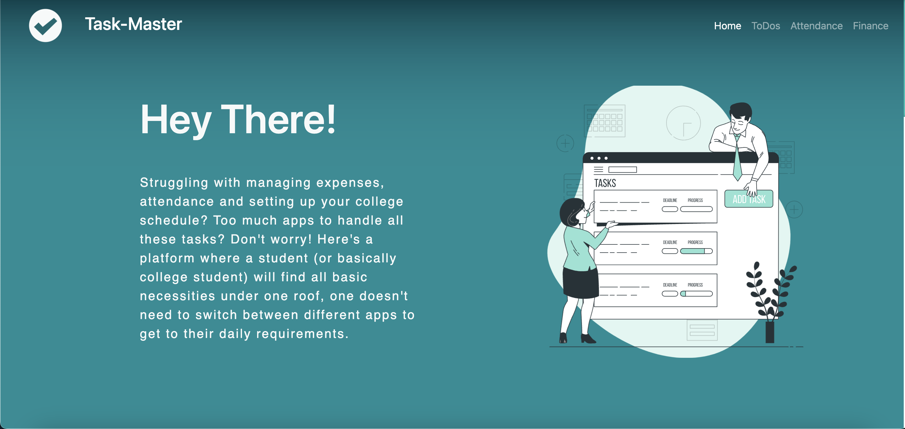

## Task-Master 
 
Struggling with managing expenses, attendance and setting up your college schedule? 
Too much apps to handle all these tasks? Don't worry! Here's a platform where a student 
(or basically college student) will find all basic necessities under one roof, 
one doesn't need to switch between different apps to get to  their daily 
requirements.

## :heavy_check_mark: Features
* Manage your tasks via ToDo List
* Manage your Financial Expenses
* Manage your Attendance

## :handshake: Contribution

Contributions are always welcomed, here is what you need to do:
1. Work on an existing issue or create a new one [here](https://github.com/mishrarahul07/Task-Master/issues)
2. Create a pull request linked to that issue

Know more about [pull request](https://docs.github.com/en/free-pro-team@latest/github/collaborating-with-issues-and-pull-requests/about-pull-requests).

## :earth_asia: Live Demo

[Visit Here](https://mishrarahul07.github.io/Task-Master/)

## :computer: Screenshots

* Home Page

## :clipboard: Contributor
Connect Here:  <a href = "https://www.linkedin.com/in/mishra-rahul07/" target="_blank">Rahul Mishra</a>
